---
{"dg-publish":true,"permalink":"/Docs for applying/Italy AI-ML Masters - Main Hub/","title":"Italy AI/ML Master's Application - Main Hub","tags":["main-hub","italy","masters","AI","ML","application","gardenEntry"]}
---

# Italy AI/ML Master's Application - Main Hub

**Your Profile:**
- Current: 7th semester Computer Engineering student at IAUT (Islamic Azad University of Tabriz)
- Graduation: June 2026
- Target: Fall 2026 Master's programs in AI/ML
- Country: Iran
- IELTS: Planning to take in 4-5 months (March-April 2026)
- Language preference: English-taught programs only

---

## 🎯 Quick Overview

**Total Universities Researched:** 8 (from CSRankings top Italy CS/AI)
**Application Deadline Range:** April-May 2026
**IELTS Requirement:** 6.0 minimum (6.5+ recommended)
**Expected Budget:** €300-€4,000/year tuition + €700-€1,000/month living

---

## 📊 Universities Comparison Table

| University | IELTS Min | TOEFL Min | Tuition/Year | Application Fee | Deadline | Ranking |
|------------|-----------|-----------|--------------|-----------------|----------|---------|
| [[Docs for applying/Politecnico di Milano\|Politecnico di Milano]] | 6.0 | 78 iBT | €3,900 | €200 | April-May 2026 | #1 Italy |
| [[Docs for applying/Sapienza University of Rome\|Sapienza University of Rome]] | 6.0 | 80 iBT | €300-€1,500 | €0 | April 29, 2026 | #1 CSRankings |
| [[Docs for applying/University of Bologna\|University of Bologna]] | 5.5-6.5 | 72-94 iBT | €2,295-€3,060 | €60 | April-May 2026 | Top 5 Italy |
| [[Docs for applying/University of Pisa\|University of Pisa]] | 6.0 (B2) | Accepted | €2,400 | €10 | June 30, 2026 | Top 5 Italy |
| [[Politecnico di Torino\|Politecnico di Torino]] | 6.0 | 78 iBT | €3,500-€4,000 | TBA | April-May 2026 | Top 3 Tech |
| [[University of Milan\|University of Milan]] | 6.0 | TBA | Variable | TBA | May 31, 2026 | Top 50 Global |
| [[University of Padua\|University of Padua]] | 6.0 | TBA | €2,500-€3,000 | TBA | April-May 2026 | Historic |
| [[University of Trento\|University of Trento]] | 6.0 | TBA | €2,500-€3,000 | TBA | April-May 2026 | Modern |

---

## 💰 Scholarship Opportunities

1. [[Docs for applying/Italian Government MAECI Scholarship\|Italian Government MAECI Scholarship]] - €900/month + full tuition
2. [[University of Milan Excellence Scholarships\|University of Milan Excellence Scholarships]] - €8,000 + tuition waiver
3. [[DSU Regional Scholarships\|DSU Regional Scholarships]] - Living expenses support
4. [[Erasmus+ Programs\|Erasmus+ Programs]] - Multi-country study programs

---

## 📅 Critical Timeline

See detailed timeline: [[Docs for applying/Application Timeline 2026\|Application Timeline 2026]]

**Key Dates:**
- **NOW - February 2026:** Research & IELTS prep
- **March-April 2026:** TAKE IELTS EXAM
- **April-May 2026:** Submit applications
- **June 2026:** Apply for study visa
- **September 2026:** Programs begin

---

## 📋 Required Documents

See full checklist: [[Docs for applying/Application Documents Checklist\|Application Documents Checklist]]

**Essential:**
- [ ] IELTS/TOEFL certificate (Target: March-April 2026)
- [ ] Official transcripts + translation
- [ ] Bachelor's degree certificate
- [ ] Motivation letter
- [ ] 2-3 recommendation letters
- [ ] Valid passport
- [ ] Declaration of Value (from Italian Embassy)

---

## 🔗 Quick Links

**Universities by Priority:**
- **Tier 1 (Highest Priority):** [[Docs for applying/Politecnico di Milano\|Politecnico di Milano]], [[Docs for applying/Sapienza University of Rome\|Sapienza University of Rome]], [[Docs for applying/University of Bologna\|University of Bologna]]
- **Tier 2 (Strong Options):** [[Docs for applying/University of Pisa\|University of Pisa]], [[Politecnico di Torino\|Politecnico di Torino]], [[University of Milan\|University of Milan]]
- **Tier 3 (Backup):** [[University of Padua\|University of Padua]], [[University of Trento\|University of Trento]]

**Resources:**
- [[Docs for applying/Iranian Student Specific Guide\|Iranian Student Specific Guide]]
- [[Grade Conversion Guide\|Grade Conversion Guide]] (Iranian 0-20 to Italian system)
- [[Visa Application Process\|Visa Application Process]]
- [[Important Websites and Portals\|Important Websites and Portals]]

---

## 🚨 Critical Reminders for Iranian Students

1. **Universitaly Portal:** All non-EU students MUST pre-enroll through https://www.universitaly.it/
2. **Embassy Contact:** Start visa process early with Italian Embassy in Tehran
3. **Translation:** All Farsi documents need certified English/Italian translation
4. **Financial Proof:** Need to show €6,000-€8,000/year for visa
5. **Early Application:** Visa processing can take 4-8 weeks

---

## 📝 Next Steps

### This Week:
- [ ] Set up IELTS exam registration
- [ ] Request transcripts from IAUT
- [ ] Identify professors for recommendation letters

### This Month:
- [ ] Start IELTS preparation (target 6.5+)
- [ ] Draft motivation letter
- [ ] Update CV to European format

### Next 3 Months:
- [ ] Take IELTS exam
- [ ] Finalize university selection (3-5 universities)
- [ ] Get documents officially translated

---

**Last Updated:** November 2, 2025
**Target Start:** September 2026

---

## Knowledge Graph Navigation

Use Obsidian's Graph View (Ctrl/Cmd + G) to see connections between:
- Universities ↔ Programs ↔ Requirements
- Scholarships ↔ Universities ↔ Deadlines
- Timeline ↔ Tasks ↔ Documents


---
tags: #main-hub #italy #masters #AI #ML #application
updated: 2025-11-03
---

# 🎯 Italy AI/ML Master's Application - Main Hub

**Your Profile:**
- **Current Status:** 7th semester Computer Engineering student at Islamic Azad University of Tabriz (IAUT)
- **Expected Graduation:** June 2026
- **Target Start:** Fall 2026 (September/October 2026)
- **Origin Country:** Iran
- **IELTS Status:** Planning to take exam in March-April 2026 (4-5 months from now)
- **Language Preference:** English-taught programs only
- **Grade System:** Iranian 0-20 scale

---

## 📊 Universities Overview (From CSRankings)

### Tier 1 - Top Priority
1. [[Docs for applying/Politecnico di Milano\|Politecnico di Milano]] - #1 in Italy for CS/AI
2. [[Docs for applying/Sapienza University of Rome\|Sapienza University of Rome]] - Most affordable, strong AI research
3. [[Docs for applying/University of Bologna\|University of Bologna]] - Oldest in Europe, excellent AI program

### Tier 2 - Strong Options
4. [[Docs for applying/University of Pisa\|University of Pisa]] - First to offer AI Master fully in English
5. [[Politecnico di Torino\|Politecnico di Torino]] - Supercomputing focus
6. [[University of Milan\|University of Milan]] - Excellence scholarships available
7. [[University of Padua\|University of Padua]] - Historic institution
8. [[University of Trento\|University of Trento]] - Modern ML/IoT focus

---

## 💰 Funding Opportunities

### Government Scholarships
- [[Docs for applying/Italian Government MAECI Scholarship\|Italian Government MAECI Scholarship]] - €900/month + full tuition
- [[Invest Your Talent in Italy\|Invest Your Talent in Italy]] - For Iranian students

### University Scholarships
- [[University of Milan Excellence Scholarships\|University of Milan Excellence Scholarships]] - €8,000 + tuition waiver
- [[DSU Regional Scholarships\|DSU Regional Scholarships]] - Lombardy region
- [[ER.GO Regional Scholarships\|ER.GO Regional Scholarships]] - Emilia-Romagna region

### EU Programs
- [[Erasmus Mundus Programs\|Erasmus Mundus Programs]] - Study at multiple EU universities

---

## 📅 Critical Timeline

**Current Status:** November 2025

### ⏰ Immediate Actions (Now - January 2026)
- [ ] Prepare IELTS exam (Target: 6.5+, Minimum: 6.0)
- [ ] Request official transcripts from IAUT
- [ ] Identify 2-3 professors for recommendation letters
- [ ] Start drafting CV and motivation letter
- [ ] Get documents translated officially (English/Italian)

### 🎯 Critical Period (February - March 2026)
- [ ] **TAKE IELTS EXAM** (Latest: Early March 2026)
- [ ] Finalize university selection (apply to 3-5 programs)
- [ ] Complete all application documents
- [ ] Contact Italian Embassy in Tehran for visa info

### 📝 Application Submission (April - May 2026)
- [ ] Submit applications (Deadlines: April 29 - May 31, 2026)
- [ ] Apply through [[Universitaly Portal\|Universitaly Portal]] for visa pre-enrollment
- [ ] Pay application fees
- [ ] Complete any required entrance exams

### 🛂 Visa Process (June - July 2026)
- [ ] Apply for study visa (Deadline: typically June 30)
- [ ] Provide financial proof (~€6,000-€8,000/year)
- [ ] Wait for visa processing (4-8 weeks)
- [ ] Arrange accommodation

### ✈️ Departure (August - September 2026)
- [ ] Receive visa
- [ ] Book flights
- [ ] Prepare for departure
- [ ] Programs begin: September 2026

---

## 📋 Required Documents Checklist

See detailed list: [[Docs for applying/Application Documents Checklist\|Application Documents Checklist]]

### Academic Documents
- [ ] Bachelor's degree certificate (or enrollment certificate)
- [ ] Official transcript with all grades
- [ ] Official translation to English/Italian
- [ ] Course descriptions/syllabus
- [ ] Declaration of Value from Italian Embassy

### Language Certificates
- [ ] IELTS Academic (Min: 6.0, Target: 6.5+) OR
- [ ] TOEFL iBT (Min: 78-80)

### Personal Documents  
- [ ] Valid passport (1+ year validity)
- [ ] Passport photos
- [ ] CV/Resume (European format)
- [ ] Motivation letter (1-2 pages)
- [ ] 2-3 Letters of recommendation

### Financial Documents
- [ ] Bank statement (proof of funds)
- [ ] Scholarship award letter (if applicable)
- [ ] Health insurance

---

## 🎓 Minimum Requirements Comparison

| University | IELTS | TOEFL iBT | GPA (Iranian) | Tuition/Year |
|---|---|---|---|---|
| [[Docs for applying/Politecnico di Milano\|Politecnico di Milano]] | 6.0 | 78 | ~14-15/20 | €3,900 |
| [[Docs for applying/Sapienza University of Rome\|Sapienza University of Rome]] | 6.0 (B2) | 80 | Not specified | €300-€1,500 |
| [[Docs for applying/University of Bologna\|University of Bologna]] | 5.5-6.5 | 72-94 | Not specified | €2,295-€3,060 |
| [[Docs for applying/University of Pisa\|University of Pisa]] | B2 (6.0) | Accepted | Not specified | €2,400 |

*Note: Most universities don't officially publish minimum GPA, but competitive programs typically expect 14-15/20 (70-75%) in Iranian system*

---

## 🔗 Important Links & Resources

### Official Portals
- **Universitaly (Visa Pre-enrollment):** https://www.universitaly.it/
- **Study in Italy:** https://studyinitaly.esteri.it/en/
- **Italian Ministry of Foreign Affairs:** https://www.esteri.it/en/

### Scholarship Portals
- **MAECI Scholarships:** https://studyinitaly.esteri.it/en/
- **Erasmus+ Programmes:** https://erasmus-plus.ec.europa.eu/

### University Rankings
- **CSRankings (CS Research Rankings):** https://csrankings.org/#/index?all&it

### Iranian Students
- **Italian Embassy in Tehran:** Check for latest procedures
- See detailed info: [[Docs for applying/Iranian Student Specific Guide\|Iranian Student Specific Guide]]

---

## 📝 Notes & Tips

### Grade Conversion (Iranian System)
- **14+/20** = Good (70%+) - Minimum competitive
- **15+/20** = Very Good (75%+) - Strong candidate
- **16+/20** = Excellent (80%+) - Top candidate

### Application Strategy
1. **Apply to 3-5 universities** (mix of reach and safe options)
2. **Submit early** where possible (better evaluation chances)
3. **Prioritize affordable options** (Sapienza, Bologna, Pisa)
4. **Don't forget application fees** range from €10-€200

### Visa Considerations for Iranian Students
- Must apply through Universitaly portal
- Pre-enrollment process is mandatory
- Start early - processing can take 4-8 weeks
- All documents must be officially translated
- Financial proof required (~€6,000-€8,000/year minimum)

---

## 📊 Next Steps

1. ✅ **This week:** Start IELTS preparation immediately
2. ✅ **By December 2025:** Complete document gathering
3. ✅ **By January 2026:** Finalize university choices
4. ✅ **By March 2026:** Take IELTS exam
5. ✅ **April-May 2026:** Submit all applications

---

## 🔍 Research Tasks

For each university you're considering:
- [ ] Research specific AI/ML research groups
- [ ] Identify professors in your areas of interest
- [ ] Check class sizes and student-professor ratio
- [ ] Look for internship opportunities
- [ ] Research job placement rates
- [ ] Find alumni from Iran (LinkedIn)

---

**Last Updated:** November 3, 2025
**Status:** Active Planning Phase
**Priority:** Prepare for IELTS exam in March-April 2026

---

## Related Notes
- [[Docs for applying/Application Timeline 2026\|Application Timeline 2026]]
- [[Docs for applying/Iranian Student Specific Guide\|Iranian Student Specific Guide]]
- [[Docs for applying/Application Documents Checklist\|Application Documents Checklist]]
- [[Scholarship Opportunities Italy\|Scholarship Opportunities Italy]]
- [[IELTS Preparation Guide\|IELTS Preparation Guide]]
---

## 📈 Visual University Comparison

### Cost vs. IELTS Requirement

```mermaid
graph TB
    subgraph "Tier 1 - Top Priority"
        PoliMi["Politecnico di Milano<br/>IELTS: 6.0 | TOEFL: 78<br/>Tuition: €3,900"]
        Sapienza["Sapienza University<br/>IELTS: 6.0 | TOEFL: 80<br/>Tuition: €300-€1,500"]
        Bologna["University of Bologna<br/>IELTS: 5.5-6.5 | TOEFL: 72-94<br/>Tuition: €2,295-€3,060"]
    end
    
    subgraph "Tier 2 - Strong Options"
        Pisa["University of Pisa<br/>IELTS: 6.0 | TOEFL: Accepted<br/>Tuition: €2,400"]
        PoliTo["Politecnico di Torino<br/>IELTS: 6.0 | TOEFL: 78<br/>Tuition: €3,500-€4,000"]
        Milan["University of Milan<br/>IELTS: 6.0 | TOEFL: 80<br/>Tuition: Variable"]
    end
    
    subgraph "Tier 3 - Additional Options"
        Padua["University of Padua<br/>IELTS: 6.0 | TOEFL: 80<br/>Tuition: €2,500-€3,000"]
        Trento["University of Trento<br/>IELTS: 6.5 | TOEFL: 90<br/>Tuition: €2,500-€3,000"]
        Catania["University of Catania<br/>IELTS: 6.0 | TOEFL: 74-80<br/>Tuition: €300-€1,500"]
    end
    
    subgraph "Business Focus"
        Bocconi["Bocconi University<br/>IELTS: 6.5 (6.0 each) | TOEFL: 88<br/>Tuition: €12,000-€14,000"]
    end
    
    PoliMi --> Sapienza
    Sapienza --> Bologna
    Bologna --> Pisa
    Pisa --> PoliTo
    PoliTo --> Milan
    Milan --> Padua
    Padua --> Trento
    Trento --> Catania
    Bocconi -.-> Milan
```



### Application Timeline Flow


---

## 🔍 Dynamic University Lists

### All Universities with Dataview

```dataview
TABLE 
  file.link as "University"
FROM "Docs for applying"
WHERE contains(file.name, "University") OR contains(file.name, "Politecnico") OR contains(file.name, "Bocconi")
SORT file.name ASC
```

---

## 🗺️ Knowledge Graph Navigation

Use Digital Garden's graph view to explore connections between:
- Universities ↔ Programs ↔ Requirements
- Scholarships ↔ Universities ↔ Deadlines
- Timeline ↔ Tasks ↔ Documents

**Graph Features:**
- **Local Graph:** See connections for current page
- **Global Graph:** View entire knowledge network
- **Backlinks:** See what links to each page
- **Search:** Find content quickly

---

*This documentation is optimized for Digital Garden with interactive graph view, search, and navigation features. All information is verified from official university sources.*
---

## ✅ Verification Status

> [!INFO] Source Verification
> All information in this documentation has been verified from official university websites. See [[Docs for applying/Verification Status and Sources\|Verification Status and Sources]] for detailed verification information.

**Verification Status:**
- ✅ All language requirements verified from official sources
- ✅ All tuition information from official sources  
- ✅ All deadlines verified from official sources
- ⚠️ Some information may vary by specific program - always check official program page

**Last Verified:** November 2025  
**Next Verification Recommended:** February 2026

---

*For detailed verification information and official source links, see [[Docs for applying/Verification Status and Sources\|Verification Status and Sources]]*
